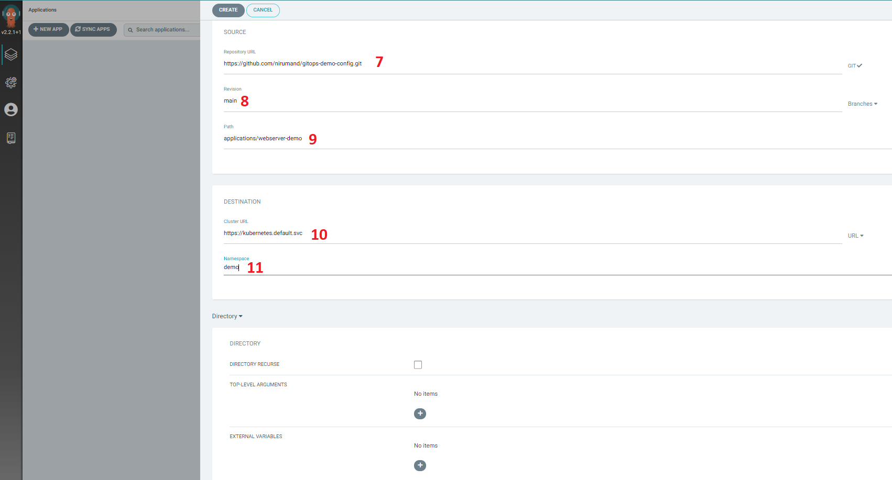
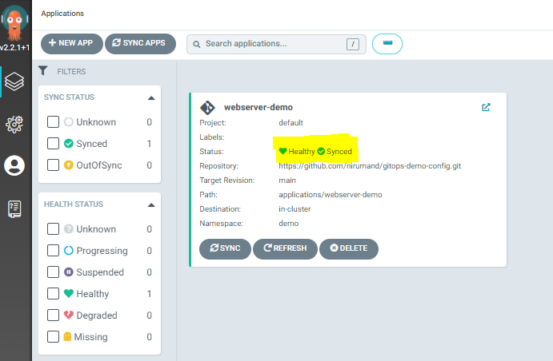
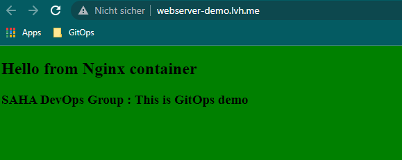

# Summary
This repository hosts examples and instruction on how to simply configure and use GitOps for testing purposes.
Please refere to [ArgoCD documentation](https://argo-cd.readthedocs.io/en/stable/) for detailed instructions.

---
**Warning**

The installation and configuration manifests are for demo purposes and __are not__ suited for production environments. 

---

# Repository Structure
There are two sets of examples:  

- The examples on the `simple-examples` folder show basic features of ArgoCD.  
- The folder `advance-examples` shows additional features, such as `declartive-setup`, `app-of-apps`, `sync-windows`, `configuration repositories` and etc.  

In addition, the folder `manifests` holds the Kubernets manifests to install various resources which will be referenced in this document relative to the repository root path.

And finally the folder `images` contains the ArgoCD UI snapshots for the purpose of documentation.

```text
├───advance-examples  
├───images
├───manifests
└───simple-examples
```

# Setup Cluster
Please first clone the repository on your local machine and change directory to the root of the this git repository.

We will use [KIND](https://github.com/kubernetes-sigs/kind/releases) to create a control-plane node with two worker nodes.

```bash
# In case any clusters already exists from previous atempts. run below:
# kind delete cluster --name gitops-demo

kind create cluster --name gitops-demo --image kindest/node:v1.22.0 --config ./manifests/gitops-demo-cluster.yaml
```

To have better experience and avoid using NodePort for services we can also use __Ingress__ to publish services on port 80 and 443.

In addition we will use `hostname` routing along `lvh.me` DNS service. 
Any request to `lvh.me` will result in IP `127.0.0.1`, but the request will have our desired hostname in request header which will be used by Ingress to route the traffic.

Our setup will use following techonolgies:

- __Ingress__ for routing external traffic to internal services
- __ArgoCD__ as GitOps Controller to deploy applications
- __Helm__ (v3) as package manager for manual installation

In addition we will use following cli tools:
- [kubectl (v1.22)](https://kubernetes.io/releases/)
- [kind](https://kind.sigs.k8s.io/)
- [argocd](https://github.com/argoproj/argo-cd/releases/tag/v2.2.1)
- [helm](https://github.com/helm/helm/releases)
- [git](https://git-scm.com/downloads)


## Ingress
1. Run the command to install:

   ```bash
   kubectl apply -f manifests/ingress-install.yaml
   ```

2. Verify installation:

   ```bash
   kubectl wait --namespace ingress-nginx --for=condition=ready pod --selector=app.kubernetes.io/component=controller --timeout=90s
   ```

   The result is like below line (pod name will be different ):
   ```text
   pod/ingress-nginx-controller-b7b74c7b7-v5pvt condition met
   ```

## ArgoCD
We will install argocd in a separate  namespace `argocd`:

1. Install ArgoCD
   ```bash
   kubectl create namespace argocd
   kubectl apply -n argocd -f manifests/argocd-install.yaml
   ```

2. Verify it is up
   ```bash
    kubectl wait --namespace argocd --for=condition=ready pod --selector=app.kubernetes.io/name=argocd-server --timeout=90s
   ```

3. Get the admin password
   ```bash
   kubectl -n argocd get secret argocd-initial-admin-secret -o jsonpath="{.data.password}" | base64 -d; echo
   ```

4. Access the admin UI for ArgoCD. 

   ```text
   https://gitops.lvh.me
   ```

   ---
   **Note**

   The hostname in this example `gitops` is not important and could be anyname. Because we use `lvh.me` for name resoulution which maps all sub-domains to `127.0.0.1`
   
   ---


# Simple Example
In this section, we will deploy application using ArgoCD UI. To do so, we need to add app configuration repository to ArgoCD. 

1. Configure Config Repository: This can be done either in UI by adding `https://github.com/nirumand/gitops-demo-config.git`
or `argocd` cli command:

   

   ```bash
    # Get the password 
    kubectl -n argocd get secret argocd-initial-admin-secret -o jsonpath="{.data.password}" | base64 -d; echo

    # login
    argocd login gitops.lvh.me --insecure

    # Add repo
    argocd repo add https://github.com/nirumand/gitops-demo-config.git --name gitops-demo-config

    # Verify
    $ argocd repo list
      TYPE  NAME                REPO                                                INSECURE  OCI    LFS    CREDS  STATUS      MESSAGE  PROJECT
      git   gitops-demo-config  https://github.com/nirumand/gitops-demo-config.git  false     false  false  false  Successful
   ```

2. First create `demo` namespace.

    ```bash
    kubectl create namespace demo
    ```

3. Add Application using UI  

     

   

4. Verify Application Health  

   

5. Access the applications: http://webapp-demo.lvh.me  
   
   Application contains some text and a green backrground  

   


# Advance Example
In this example we will explore couple of ArgoCD features:
- Argo Projects, Argo Users
- Helm applications
- App of Applications

## Prepare Environment
In this setup we will create an `ArgoProj` which can only access a specific namespace. Also we will create a user account which can only manage and access objects in a specific `ArgoProj`. 

For example, `ArgoProj` with name `gitops-dev` can create kubernetes resources only in namespace `demo-dev` and can be managed only by user `admin` and `gitops-dev`

---
**Note**

User accounts in ArgoCD in this example are only valid in argocd enviroments and are not related to any kubernetes users.

---

1. Install namespaces
   
   ```bash
   kubectl create namespace demo-dev 
   kubectl create namespace demo-test
   kubectl create namespace demo-prod
   ```
2. Install argo projects `ArgoProj` and add users 
   
   ```bash
   kubectl apply -f ./manifests/argo-projects.yaml -n argocd
   ```
3. Set password for argo user accounts
   
   ```bash
   argocd account update-password --account gitops-dev  --current-password <admin-password> --new-password password1

   argocd account update-password --account gitops-test --current-password <admin-password> --new-password password2
   
   argocd account update-password --account gitops-prod --current-password <admin-password> --new-password password3
   ```
   ---
   **Note**

   The password for user accounts can be changed only by admin user and using admin password

   ---

4. Add config git repository by UI 

   https://github.com/nirumand/gitops-demo-config.git

   or Declartive

   ```bash
   kubectl apply -f .\manifests\argocd-app-config-repositories.yaml
   ``` 
   
   or by argocd cli command
   
   ```bash
   argocd login gitops.lvh.me --insecure
   argocd repo add https://github.com/nirumand/gitops-demo-config.git --name gitops-demo-config
   ```
   ---
   **Note**
   
   Repositories can be scoped by Project. This is recommended for configuration repositories based on Devlopment Teams, Environments,...

   ---

## Install Applications
In this example we will install an application using declarative setup of argo application `Application` and use command line to deploy.

1. On the config repository run following command

   ```bash
   kubectl apply -f .\simple-examples\applications\argoapp-webserver-demo.yaml -n argocd
   ```
2. Access the webpage

   http://webapp-demo.lvh.me


## App-of-Apps
We can install multiple Argo `Application` using the `app-of-apps` pattern. That basically means we will install an `Application` which references a Git Repository path for our apps `Application` manifests. The advantage of using of this pattern is to install or uninstall applications in one action. This will be specially important when dealing with lots of microservices that need to be started or stopped at the same time and saves us from running loops in shell scripts!

To start all applications in the repo under folder `advance-examples/applications`

```bash
kubectl apply -f .\advance-examples\argoapp-app-of-apps.yaml -n argocd
```

To remove all applicaitons and clean up

```bash
kubectl delete -f .\advance-examples\argoapp-app-of-apps.yaml -n argocd
```

## Sync Windows
The application synchronization can be restricted to non-business hours. This avoids distruption in services during daily work.

In this example, we have defined two sync windows for the argo project `gitops-prod`.

- Allow sync everyday at 8 PM fro two hours
- Deny Sync everyday at 8 am for 12 hours. During this time, manual syncing is also disabled.

Application can be manually synced if it is not in the `deny` sync window. If application configuration is changed, ArgoCD will info about the sync windows:

```bash
kubectl apply -f .\advance-examples\applications\argoapp-webserver-prod.yaml -n argocd
```


